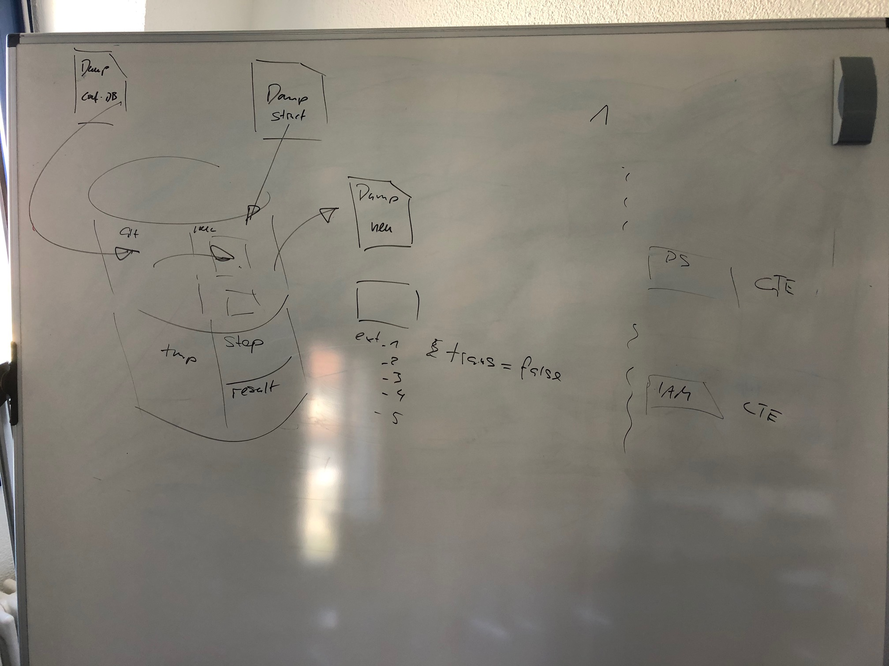

# mig_trafo

Repo für die Simi Datenmigration und die Transformation Db2Json.



Dokumentation zum neuen Datenmodell [hier](https://github.com/simi-so/simi/tree/master/code/doc):


## Datenmigration

* Mittels lokalem GRETL
* Muss mittels Knopdruck wiederholt werden können. Wenn vom Aufwand her vertretbar inklusive inklusive
  * Einspielung des Config-DB Dump
  * Anwenden des DDL-SQL zwecks Erstellung der leeren Tabellen der SIMI-DB

### Artefakte

* "Conf-DB Dump" Dump von Struktur und Inhalt der Config-DB
* "Dump Struct": SQL-DDL Datei der Struktur der SIMI-DB (ohne Inhalt)
* "Dump neu": Dump von Struktur und Inhalt der SIMI-DB (mit Inhalt nach Datenmigration)

### Strukturierung der Arbeits-DB
* Schema "gdi_knoten" und "iam" --> aus Dump-Restore der Config-DB
* Schema "public" --> leere simi Tabellen. Tabellen tragen Präfix entsprechend Teilmodell. Bsp simidata_* --> Teilmodell data
* Schema "migration" oder "tmp" oder ähnlich: 

### Zu beachten

* Jedes Objekt hat in Simi  Meta-Attribute. Diese sind sinngemäss dem folgendem SQL-Snipplet zu setzen. Bei Vererbungen haben die Basisklassen das Attribut dtype. Inhalt von dtype
  * IAM
    * simiiam_Identity
  * ....
* Die Vererbungsstrategie in SIMI ist meist "joined". Entsprechend werden Kindinformationen in einer separaten Tabelle mit
Foreign Key auf die "Muttertabelle" abgebildet.
  
```sql
SELECT 
    1 AS "version",
    'admin' AS created_by,
    'admin' AS updated_by,
    now() AS  create_ts, 
    now() AS update_ts,
    'simi_FacadeLayer' AS dtype_fl,
    'simi_PostgresDS' AS dtype_pds,
    'simi_LayerGroup' AS dtype_lg,
    'simi_map' AS dtype_map
FROM 
    generate_series(1,1) 
```

## Json Transformation

Die Erstellung der CTE's soll konkrete Anforderungen liefern bezüglich der Komponente "JsonTrafo", welche schlussendlich 
die aus den CTE's resultierenden Query-Resultate in eine Json-Datei schreibt.

Mögliche Anforderungen:
* Ausführen von vorverarbeitenden Queries
* "Insert" der Query-Resultate in ein Template-Json
* ...?

Um die Resultate der Queries ohne "JsonTrafo" einfach Sichten zu können, werden diese in Resultat-Tabellen geschrieben. 
Pro Resultat-json kommt ein bis wenige CTE zum Einsatz. Ausführen der Queries mittels lokalem GRETL.

### Strukturierung der Arbeits-DB
* Schema "trafostep": Für allfällig sinnvolle Views (oder falls nötig Zwischentabellen) mit mehrfach verwendetem Inhalt.
* Schema "result": Für die Resultat-Tabellen


 


